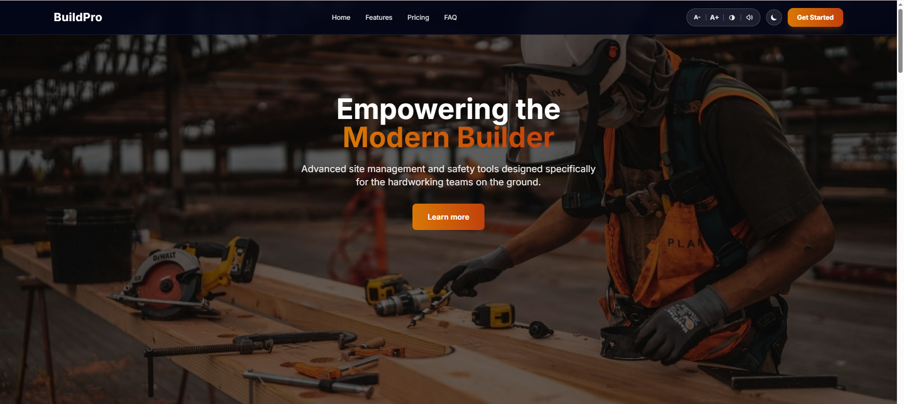
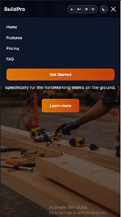

# 🏗️ BuildPro - Modern Builder Landing Page

🔗 **Live Website:** [https://fda-task-5-e95f.vercel.app/](https://fda-task-5-e95f.vercel.app/)

## 💻 Desktop View

---

## 📌 Overview

BuildPro is a highly optimized, fully responsive, and accessible landing page designed for modern construction and site management software. Built with semantic HTML, Tailwind CSS, and Vanilla JavaScript, this project emphasizes clean UI/UX, advanced accessibility (a11y) features, and high performance.

---

## ✨ Key Features

- **Modern UI/UX:** Glassmorphism navbar, smooth scrolling, and professional Royal Bronze gradients.
- **Dark/Light Mode:** Seamless theme toggling with system preference detection and LocalStorage support.
- **Advanced Accessibility (a11y):**
  - 🔠 **Text Resizer:** Increase or decrease base font size (A+ / A-).
  - ◑ **High Contrast Mode:** Enhanced visual contrast for better readability.
  - 🔊 **Text-to-Speech:** Integrated screen reader functionality for visually impaired users.
- **Performance Optimized:** 100% SEO Score, Lazy loading for images, and compressed assets.
- **Responsive Design:** Flawless experience across all devices with an intuitive mobile hamburger menu.
- **Form Validation:** Client-side validation ensuring robust data entry for the contact section.

---

## 🛠️ Tech Stack

- **HTML5:** Semantic and SEO-friendly structure.
- **Tailwind CSS:** Utility-first framework for rapid, responsive styling.
- **JavaScript:** For DOM manipulation, interactivity, and custom accessibility logic.

---

## 📱 Mobile View

---
*Designed & Developed for FDA Week 4 Internship Task.*"# updates_week_4" 
